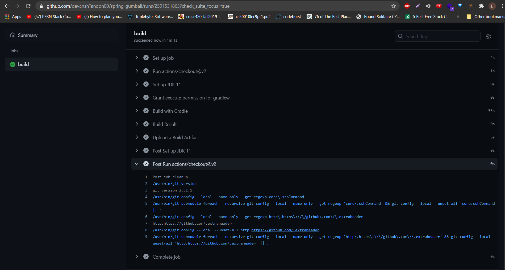
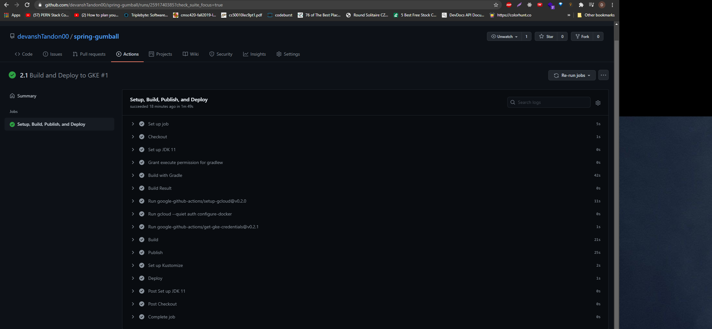
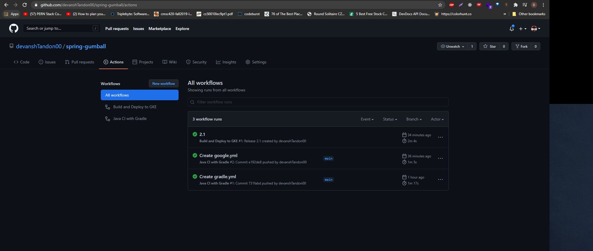
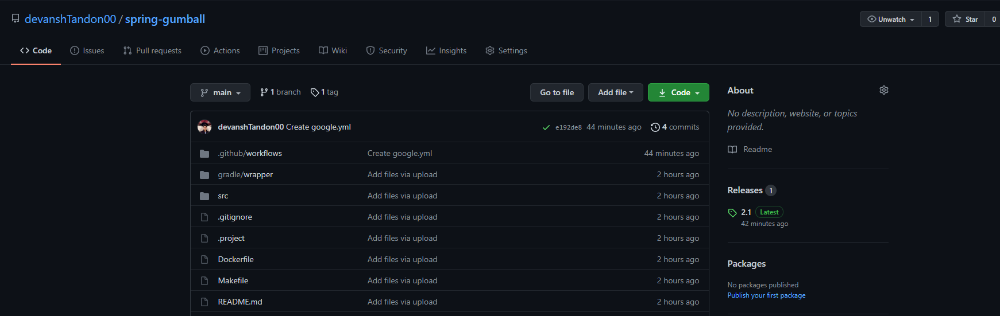
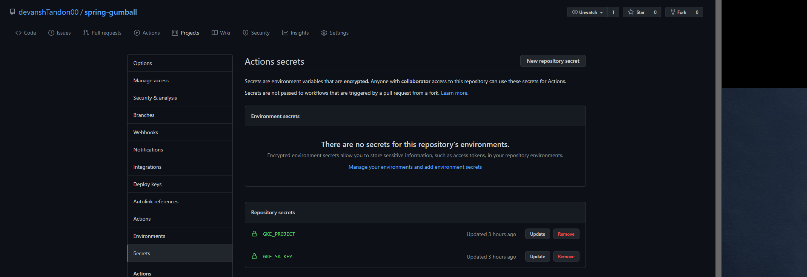
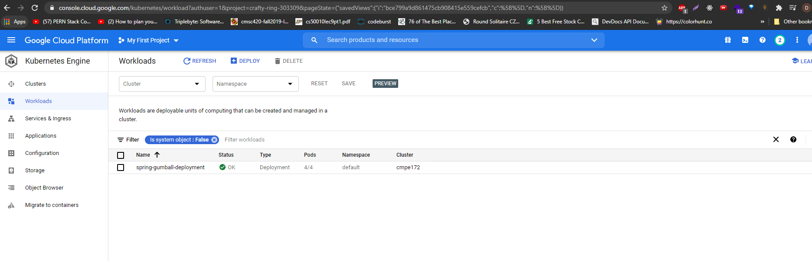
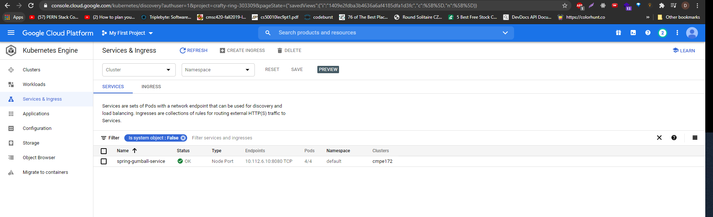
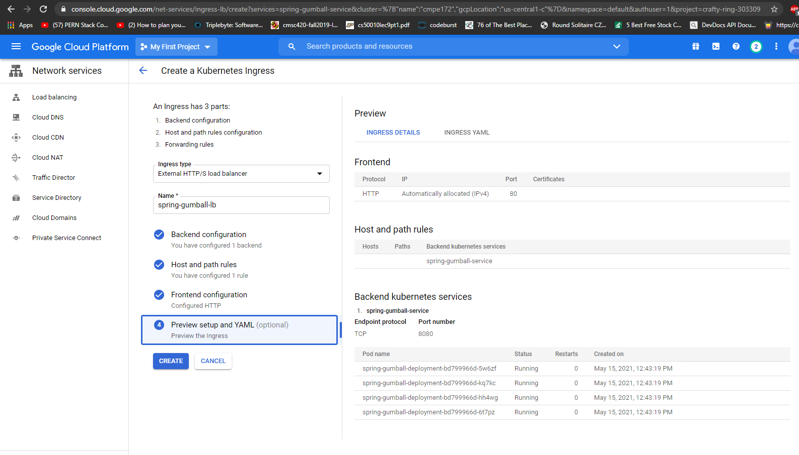
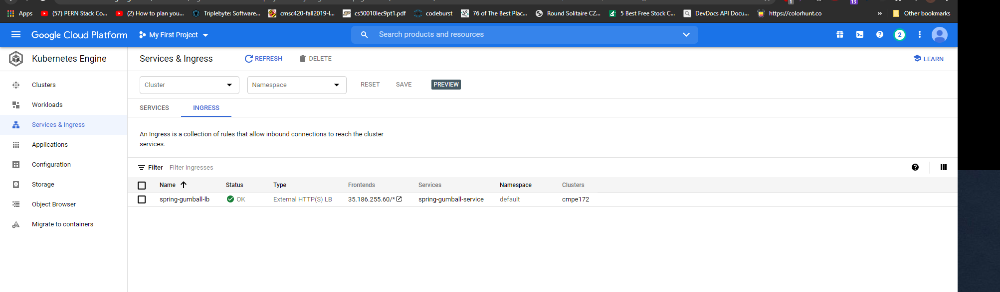
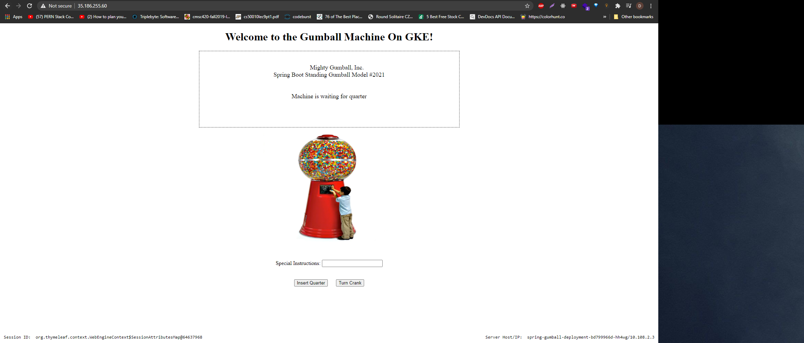

# CMPE 172 - Lab #10

### CI Workflow (Part 1)

The first three screenshots show all the workflows and the individual builds.

### CD Workflow (Part 2)

This shows a proof of the successful release of version 2.1.

This shows the secrets I created

These screenshots show the deployment of the workloads, services and the ingress. 

This screenshot is a proof of the working of the GCP and the deployment.

